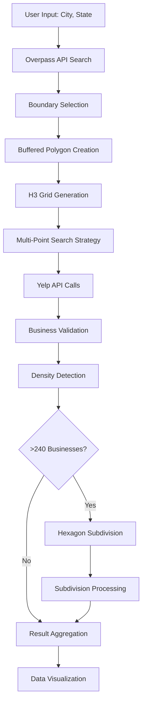

# 🗺️ City Polygon Viewer with Advanced Yelp Integration

A sophisticated geospatial web application that combines city boundary visualization with intelligent business discovery using H3 hexagon grids and the Yelp API. This isn't just a simple map viewer—it's a comprehensive business intelligence platform that demonstrates advanced geospatial processing, API management, and data visualization techniques.

## 🌟 Overview

This application transforms city boundary data into a powerful business discovery tool by:
- Fetching precise city boundaries from OpenStreetMap
- Generating H3 hexagon grids for systematic area coverage
- Performing intelligent business searches using the Yelp API
- Automatically subdividing dense areas for complete coverage
- Providing multiple visualization methods for data exploration

## 🚀 Key Features

### 🏙️ **Advanced City Boundary Processing**
- **Multi-Strategy Boundary Fetching**: Uses three different Overpass API strategies with intelligent fallbacks
- **Precise GeoJSON Rendering**: No simplification—shows exact city boundaries as stored in OSM
- **Multi-Polygon Support**: Handles complex cities with multiple boundary areas
- **Buffered Coverage**: Creates 1km buffer zones to ensure edge-case businesses aren't missed

### 🌐 **H3 Hexagon Grid System**
- **Resolution 7 Grids**: ~4.8 km² hexagons for optimal business coverage
- **Automatic Subdivision**: Dense areas (>240 businesses) split into Resolution 8 hexagons
- **Smart Coverage Strategy**: Multi-point search system ensures complete hexagon coverage
- **Geographic Validation**: Businesses filtered to ensure they're actually within hexagon boundaries

### 🍕 **Intelligent Yelp Integration**
- **Multi-Point Search**: Each hexagon searched from multiple strategic points
- **Pagination Handling**: Automatically fetches all available results (up to 200 per search)
- **Business Deduplication**: Smart filtering removes duplicate businesses across search points
- **Rate Limiting**: Sophisticated API management (50 req/sec, 5,000/day limits)
- **Quota Management**: Real-time tracking and optimization recommendations

### 📊 **Advanced Data Visualization**
- **Three Display Methods**: Expandable cards, tabbed interface, and searchable accordion
- **Real-Time Statistics**: Processing progress, quota usage, and coverage quality metrics
- **Interactive Maps**: Toggle layers, zoom controls, and hexagon numbering
- **Search & Filter**: Find businesses by name, category, or hexagon status

## 🏗️ Architecture

### **Frontend Stack**
- **Next.js 15** with App Router for modern React development
- **TypeScript** for type safety and better developer experience
- **Tailwind CSS** for responsive, modern UI design
- **Leaflet** for interactive mapping with custom styling
- **React Hook Form** for efficient form handling

### **Backend Services**
- **OpenStreetMap Overpass API** for city boundary data
- **Nominatim API** as fallback for boundary fetching
- **Yelp Fusion API** for business search and discovery
- **H3-JS** for hexagon grid generation and manipulation
- **Turf.js** for geospatial calculations and buffering

### **Core Libraries**
- **@turf/turf**: Geospatial analysis and polygon operations
- **h3-js**: H3 hexagon grid system for geographic indexing
- **leaflet.markercluster**: Efficient marker clustering for large datasets

## 🎯 How It Works

### **Phase 1: City Boundary Acquisition**
1. **Input Processing**: User enters city name in "City, State" format
2. **Multi-Strategy Search**: Three Overpass API strategies executed in sequence:
   - Standard city boundaries (admin_level 7-8)
   - Comprehensive search (all boundary types)
   - Aggressive search (any matching geographic feature)
3. **Boundary Selection**: Intelligent algorithm selects best boundary based on:
   - Administrative level priority
   - Geographic completeness
   - Data quality indicators
4. **Fallback Handling**: Nominatim API used if Overpass strategies fail

### **Phase 2: H3 Grid Generation**
1. **Buffered Polygon Creation**: 1km buffer added around city boundary
2. **Hexagon Grid Generation**: H3 hexagons generated to cover buffered area
3. **Resolution Optimization**: Resolution 7 hexagons (~4.8 km²) for optimal coverage
4. **Grid Statistics**: Coverage area, hexagon count, and size calculations

### **Phase 3: Business Discovery**
1. **Multi-Point Search Strategy**: Each hexagon searched from multiple points:
   - Center point with optimized radius
   - Corner points for edge coverage
   - Edge midpoints for complete coverage
2. **Adaptive Coverage**: Search point count based on hexagon size:
   - Small hexagons (<3 km²): 1 search point
   - Medium hexagons (3-8 km²): 3 search points
   - Large hexagons (>8 km²): 5+ search points
3. **Yelp API Integration**: Paginated searches with rate limiting
4. **Business Validation**: H3 boundary checking ensures accuracy

### **Phase 4: Dense Area Processing**
1. **Density Detection**: Hexagons with >240 businesses flagged for subdivision
2. **Automatic Splitting**: Dense hexagons split into Resolution 8 sub-hexagons
3. **Subdivision Queue**: Child hexagons queued for separate processing
4. **Result Aggregation**: Parent and child results merged for complete view

## 🎮 User Interface Guide

### **Main Search Interface**
- **City Input**: Enter city name in "City, State" format (e.g., "Miami, FL")
- **Search Button**: Initiates the complete city analysis process
- **Loading States**: Real-time progress indicators during processing
- **Error Handling**: Clear error messages with helpful suggestions

### **Map Visualization**
- **Layer Controls**: Toggle visibility of different map elements:
  - City Boundary (blue): Original city limits
  - Buffered Area (purple): 1km expansion zone
  - H3 Grid (green): Hexagon coverage areas
  - Hexagon Numbers (orange): Correlation with data tables
- **Interactive Features**: Zoom, pan, and click for detailed information
- **Restaurant Markers**: Clustered markers showing discovered businesses

### **Data Display Methods**

#### **Method 1: Expandable Hexagon Cards**
- **Grid Layout**: Responsive card grid showing all processed hexagons
- **Quick Stats**: Business count and status at a glance
- **Expandable Details**: Click to see full business listings
- **Status Indicators**: Color-coded status (fetched, failed, dense, split)

#### **Method 2: Tabbed Interface**
- **Summary Tab**: Overview statistics and progress tracking
- **Details Tab**: Individual hexagon processing results
- **Restaurants Tab**: Complete business directory with filtering

#### **Method 3: Searchable Accordion**
- **Search Box**: Filter by business name, category, or hexagon status
- **Accordion Layout**: Expandable sections for detailed exploration
- **Real-time Filtering**: Instant results as you type

### **Yelp Integration Controls**
- **Test Mode Toggle**: Safe testing with limited API usage
- **API Call Estimation**: Real-time quota usage predictions
- **Processing Status**: Live updates on hexagon processing
- **Quota Monitoring**: Daily and per-second usage tracking

## 🔧 Technical Implementation

### **API Rate Limiting**
```typescript
// Sophisticated rate limiting system
class RateLimiter {
  private maxPerSecond: number = 50;
  private maxPerDay: number = 5000;
  
  async waitForSlot(): Promise<void> {
    // Queue management with exponential backoff
  }
}
```

### **H3 Grid Processing**
```typescript
// Intelligent hexagon subdivision
export function splitHexagon(
  h3Id: string, 
  currentResolution: number = 7, 
  targetResolution: number = 8
): HexagonSplitResult {
  const childHexagons = h3.cellToChildren(h3Id, targetResolution);
  // Process subdivision with quota management
}
```

### **Business Validation**
```typescript
// Ensure businesses are within hexagon boundaries
private validateBusinessBoundaries(h3Id: string, businesses: YelpBusiness[]): YelpBusiness[] {
  return businesses.filter(business => {
    const businessH3Id = h3.latLngToCell(
      business.coordinates.latitude, 
      business.coordinates.longitude, 
      h3.getResolution(h3Id)
    );
    return businessH3Id === h3Id;
  });
}
```

## 📊 Data Flow



## 🚀 Getting Started

### **Prerequisites**
- Node.js 18+ 
- npm or yarn
- Yelp Fusion API key (for full functionality)

### **Installation**
```bash
# Clone the repository
git clone <repository-url>
cd city-polygon-viewer

# Install dependencies
npm install

# Set up environment variables
cp .env.example .env.local
# Add your Yelp API key to .env.local
YELP_API_KEY=your_yelp_api_key_here

# Start development server
npm run dev
```

### **Environment Configuration**
Create a `.env.local` file with:
```env
YELP_API_KEY=your_yelp_fusion_api_key
```

### **Available Scripts**
```bash
npm run dev          # Start development server with Turbopack
npm run build        # Build for production
npm run start        # Start production server
npm run lint         # Run ESLint
```

## 🌍 Example Cities to Try

### **US Cities**
- **Miami, FL** - Large city with complex boundary and dense business areas
- **Key Biscayne, FL** - Island municipality with precise coastline
- **San Francisco, CA** - Peninsula city with natural boundaries
- **Manhattan, NY** - Dense urban area perfect for subdivision testing
- **Austin, TX** - Growing city with mixed urban/suburban areas

### **International Cities**
- **Paris, France** - Complex administrative boundaries
- **London, UK** - Multi-polygon city with historical boundaries
- **Tokyo, Japan** - Dense urban area with extensive business coverage

## 📈 Performance Optimizations

### **API Efficiency**
- **Intelligent Caching**: Repeated searches use cached results
- **Quota Optimization**: Smart batching to maximize API usage
- **Rate Limiting**: Prevents API quota exhaustion
- **Error Recovery**: Automatic retry with exponential backoff

### **UI Performance**
- **Virtual Scrolling**: Efficient rendering of large datasets
- **Marker Clustering**: Optimized map performance with many markers
- **Lazy Loading**: Components loaded only when needed
- **Memory Management**: Proper cleanup of map instances

### **Geospatial Optimizations**
- **H3 Efficiency**: Fast geographic indexing and queries
- **Boundary Validation**: Efficient point-in-polygon testing
- **Grid Optimization**: Adaptive search point generation
- **Subdivision Logic**: Smart dense area detection

## 🔍 Advanced Features

### **Two-Phase Processing Algorithm**
1. **Phase 1**: Process all hexagons at Resolution 7
2. **Phase 2**: Process subdivision queue at Resolution 8
3. **Result Merging**: Combine parent and child results intelligently

### **Coverage Quality Assessment**
- **Excellent**: 7+ search points, 100+ businesses
- **Good**: 5+ search points, 50+ businesses  
- **Fair**: 3+ search points, 20+ businesses
- **Poor**: <3 search points, <20 businesses

### **Quota Management System**
- **Daily Tracking**: 5,000 API calls per day limit
- **Per-Second Limiting**: 50 requests per second maximum
- **Usage Projections**: Predictive quota consumption modeling
- **Optimization Recommendations**: Smart suggestions for efficient usage

## 🛠️ Development

### **Project Structure**
```
src/
├── app/
│   ├── api/
│   │   ├── city/route.ts      # City boundary API
│   │   └── yelp/route.ts      # Yelp integration API
│   ├── globals.css            # Global styles
│   ├── layout.tsx             # Root layout
│   └── page.tsx               # Main page
├── components/
│   ├── CityMap/               # Map components
│   │   ├── CityMapCore.tsx    # Core map logic
│   │   ├── HexagonDisplay.tsx # Data visualization
│   │   ├── MapControls.tsx    # Layer controls
│   │   └── YelpIntegration.tsx # Yelp UI
│   └── CityMap.tsx            # Main map component
└── lib/
    ├── geo.ts                 # Geographic utilities
    ├── yelpSearch.ts          # Yelp API integration
    ├── hexagonCoverage.ts     # Coverage strategies
    ├── hexagonProcessor.ts    # Processing pipeline
    ├── hexagonSplitter.ts     # Subdivision logic
    ├── apiQuotaManager.ts     # Quota management
    ├── rateLimiter.ts         # Rate limiting
    └── overpassStrategies.ts  # Boundary fetching
```

### **Key Design Patterns**
- **Strategy Pattern**: Multiple Overpass API strategies
- **Observer Pattern**: Real-time status updates
- **Factory Pattern**: Hexagon processing pipeline
- **Command Pattern**: API request management

## 🚀 Deployment

### **Vercel (Recommended)**
```bash
# Install Vercel CLI
npm i -g vercel

# Deploy
vercel

# Set environment variables in Vercel dashboard
YELP_API_KEY=your_api_key
```

### **Other Platforms**
- **Netlify**: Static export with serverless functions
- **AWS/GCP**: Container deployment with Node.js runtime
- **Docker**: Containerized deployment option

## 🤝 Contributing

1. Fork the repository
2. Create a feature branch (`git checkout -b feature/amazing-feature`)
3. Commit your changes (`git commit -m 'Add amazing feature'`)
4. Push to the branch (`git push origin feature/amazing-feature`)
5. Open a Pull Request

## 📄 License

This project is licensed under the MIT License - see the [LICENSE](LICENSE) file for details.

## 🙏 Acknowledgments

- [OpenStreetMap](https://www.openstreetmap.org/) contributors for geographic data
- [Nominatim](https://nominatim.org/) for geocoding services
- [Yelp Fusion API](https://www.yelp.com/developers/documentation/v3) for business data
- [H3](https://h3geo.org/) for hexagon grid system
- [Leaflet](https://leafletjs.com/) for mapping capabilities
- [Next.js](https://nextjs.org/) team for the excellent framework

## 📞 Support

For questions, issues, or contributions:
- Open an issue on GitHub
- Check the documentation in the `/docs` folder
- Review the code comments for implementation details

---

**Built with ❤️ using Next.js, TypeScript, and advanced geospatial processing techniques.**